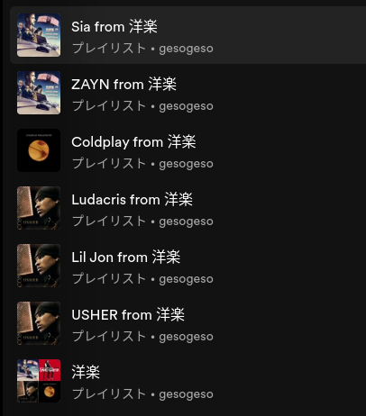

# Artistify
Artistify creates artist-specific playlists from existing ones.

## Usage
Please prepare a .env file first.

### .env file
```plaintext
CLIENT_ID=xxxxxxxxxx
CLIENT_SECRET=xxxxxxxxxx
```

### usage of each api

#### show_tracks_in_playlist
show (song, list of artists) in a playlist
```
$ python main.py show-tracks-in-playlist 6CpQWdViAFjjnXCEudZVQR
Getting playlist info for ID: 6CpQWdViAFjjnXCEudZVQR
--------------------------------------------------
track: Elastic Heart
artists: Sia
--------------------------------------------------
track: Rainbow
artists: Sia
--------------------------------------------------
track: Sugar (feat. Francesco Yates)
artists: Robin Schulz, Francesco Yates
--------------------------------------------------
track: Titanium (feat. Sia)
artists: David Guetta, Sia
--------------------------------------------------
track: Dusk Till Dawn (feat. Sia) - Radio Edit
artists: ZAYN, Sia
--------------------------------------------------
track: Yellow
artists: Coldplay
--------------------------------------------------
track: Adventure of a Lifetime
artists: Coldplay
--------------------------------------------------
track: Shape of My Heart
artists: Backstreet Boys
```

#### output_tracks_by_artist_in_playlist
This command outputs a JSON summary of the songs in the specified playlist by artist.
The following example is based on my [playlist](https://open.spotify.com/playlist/3F9A3KdcaLXnI59AM9a4uV?si=fc9bea86aa784d62) as input.
```
$ python main.py output-tracks-by-artist-in-playlist 3F9A3KdcaLXnI59AM9a4uV "hoge.json" 
$ cat hoge.json
{"23zg3TcAtWQy7J6upgbUnj": ["5rb9QrpfcKFHM1EUbSIurX"], "7sfl4Xt5KmfyDs2T3SVSMK": ["5rb9QrpfcKFHM1EUbSIurX"], "3ipn9JLAPI5GUEo4y4jcoi": ["5rb9QrpfcKFHM1EUbSIurX"], "4gzpq5DPGxSnKTe4SA8HAU": ["3AJwUDP919kvQ9QcozQPxg"], "5ZsFI1h6hIdQRw2ti0hz81": ["1j4kHkkpqZRBwE0A4CN4Yv"], "5WUlDfRSoLAfcVSX1WnrxN": ["1j4kHkkpqZRBwE0A4CN4Yv", "79weO6yONe0oyPFWXjJroW", "6kwAbEjseqBob48jCus7Sz"], "1Cs0zKBU1kc0i8ypK3B9ai": ["79weO6yONe0oyPFWXjJroW"]}
```

```
$ python main.py output-tracks-by-artist-in-playlist 3F9A3KdcaLXnI59AM9a4uV "hoge.json" name
$ cat hoge.json
{"USHER": ["Yeah! (feat. Lil Jon & Ludacris)"], "Lil Jon": ["Yeah! (feat. Lil Jon & Ludacris)"], "Ludacris": ["Yeah! (feat. Lil Jon & Ludacris)"], "Coldplay": ["Yellow"], "ZAYN": ["Dusk Till Dawn (feat. Sia) - Radio Edit"], "Sia": ["Dusk Till Dawn (feat. Sia) - Radio Edit", "Titanium (feat. Sia)", "Elastic Heart"], "David Guetta": ["Titanium (feat. Sia)"]}
```


#### artisfy
```
$ python main.py artisfy 3F9A3KdcaLXnI59AM9a4uV
```
The playlists for the artists Sia, ZAYN, Coldplay, and Usher, respectively, will be created.





## ToDo
Based on the image above, it's clear that the song "yeah" features Usher as the main vocalist, but playlists for Lil Jon and Ludacris were also created. I'll revise it to create playlists only for Usher.
